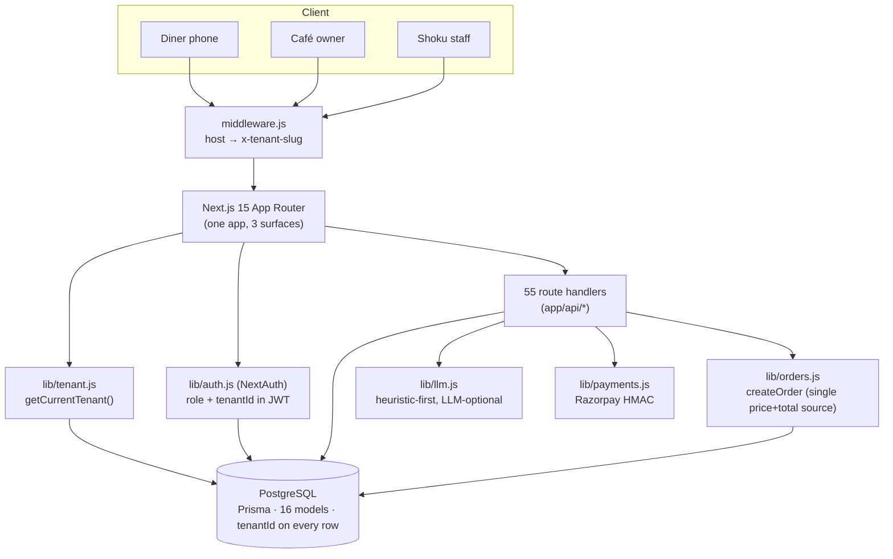

# Shoku — Architecture & Onboarding

**Start here.** This is the map of the whole system for someone joining the project. Read this
top-to-bottom once (~20 min), then use the "go deeper" pointers. For exhaustive detail see
[`content/developer-guide.md`](../content/developer-guide.md); this doc is the mental model.

---

## 1. What Shoku is

An **AI-powered, white-label, multi-tenant online-ordering platform + light POS for cafés**.
Each café ("tenant") gets its own branded ordering app on its own subdomain — its name,
colours, menu, loyalty, and an AI assistant — with no app to download. Cafés pay a flat SaaS
fee and keep 100% of every order (vs. handing 20–30% to a delivery aggregator).

One Next.js app serves **three surfaces**, chosen by hostname:

| Surface | Host | Who | What |
| --- | --- | --- | --- |
| **Storefront** | `<cafe>.getshoku.com` | Diners | Menu, AI assistant, cart, checkout, loyalty, account, shop |
| **Café admin** | `<cafe>.getshoku.com/admin` | Owner/staff | Menu, orders, POS, analytics, marketing, loyalty, branding, settings |
| **Platform** | `getshoku.com` (apex) | Shoku team | Marketing site, `/super` console, cross-café analytics, pitch deck |

## 2. The 5-minute mental model

- **One app, one database, multi-tenant by row.** Every table carries a `tenantId`; every query
  filters on it. There is no DB-per-café — isolation is enforced in application code.
- **The hostname picks the tenant.** `middleware.js` reads the subdomain and sets an
  `x-tenant-slug` header; server code resolves the tenant from it.
- **Auth is NextAuth (JWT).** The token carries `role` + `tenantId`; route handlers read those to
  authorize. Four roles: `superadmin`, `owner`, `staff`, `customer`.
- **AI is heuristic-first, LLM-optional.** Everything works with zero external services; adding an
  API key upgrades the AI features automatically.



## 3. Tech stack (current)

- **Framework:** Next.js **15.5** (App Router) + React 18 — server components + route handlers.
- **DB:** **PostgreSQL** via Prisma ORM (migrated from SQLite; see [`POSTGRES-CUTOVER.md`](POSTGRES-CUTOVER.md)).
- **Auth:** NextAuth **v4** (Credentials + phone-OTP + Google), JWT sessions, bcrypt.
- **Styling:** Tailwind CSS; brand colours are CSS variables for live white-label theming.
- **AI:** OpenAI-compatible **or** Anthropic (`lib/llm.js`), always with a rule-based fallback.
- **Payments:** Razorpay (HMAC-verified); mock/pay-at-counter fallback when unconfigured.
- **Tests:** Vitest (pure-logic units). **CI:** GitHub Actions (Postgres service → test → build → `npm audit` gate).

## 4. How a request works (the core loop)

1. **`middleware.js`** (edge): parses the café slug from `Host`, forwards it as `x-tenant-slug`.
   On a café host it also rewrites `/` → `/menu`.
2. **`getCurrentTenant()`** (`lib/tenant.js`): resolves the tenant from `x-tenant-slug` → host →
   default. (Next 15: `headers()` is awaited.)
3. **Auth gates** (`lib/admin.js`): `requireAdmin()` / `requireSuperadmin()` read the JWT and
   return the caller's `tenantId`; every query then scopes `where: { tenantId }`.
4. **Data** via Prisma. Money/totals are computed in exactly one place — `createOrder`
   (`lib/orders.js`) — so online, POS, and guest checkout can never drift.

**Where things live:** `app/` (routes + pages), `lib/` (26 domain modules — the real logic),
`components/` (shared UI), `prisma/` (schema + seed), `scripts/` (ops + migrations), `docs/`.

## 5. Feature map (what's built)

**Storefront (diner):** menu with **dietary filters** (Jain/vegan/eggless/vrat/halal/diabetic —
`lib/foodIntel.js`), item **food-intelligence** panel (origin/nutrition/allergens/FSSAI), **AI
assistant** (`/ai`), cart with **pairing upsell**, checkout (Razorpay or pay-at-counter),
**loyalty** redeem, **caffeine ledger**, **share-to-earn**, **Shop** (merch, counter-pickup),
dine-in QR.
**Auth v2:** phone-OTP (`lib/otp.js`), guest checkout with auto-claim, Google (env-gated), email.

**Café admin (`/admin`):** menu (+ CSV import, AI images), orders, **POS Phase 1** (counter
billing, KOT, GST invoice, day-end Z-report — `lib/pos.js`), analytics (+ per-location),
customers, feedback, discounts, loyalty, WhatsApp marketing, banners, branding, settings,
**share-post approvals**, tables/QR.

**Platform (`/super`):** café provisioning, **per-café AI provider + key** (encrypted at rest —
`lib/crypto.js`), plan/POS add-on management, cross-café analytics, audit log, pitch deck.

**Cross-cutting:** WhatsApp engine (`lib/whatsapp.js`, provider-agnostic, demo mode), rate
limiting (`lib/rateLimit.js`), markdown sanitization (`lib/sanitize.js`), audit logging.

## 6. Data model at a glance (16 models)

`Tenant` (café + white-label + POS/AI config) · `User` (all four roles, phone/OTP fields) ·
`Category` → `Item` (menu; also merch via `type`) · `Order` → `OrderItem` · `Discount` ·
`Reward` · `Table` · `Feedback` · `Banner` · `Campaign` → `Message` (WhatsApp) · `AuditLog` ·
`PitchDeck` · `SocialPost` (share-to-earn).

**Convention:** arrays/JSON are stored as **`String`** (e.g. `Item.sizes/ingredients/diet`,
`Tenant.tiers/locations`) and parsed via helpers (`parseItem`, `parseTiers`). Always
`JSON.stringify` on write. (Kept from the SQLite era; could move to native `Json` later.)

## 7. The AI layer (why it never hard-fails)

`lib/llm.js` is the single bridge. `llmComplete()` returns **`null`** on any failure (no key, bad
response, exception), so every caller falls back to a heuristic. Per-café keys (set in `/super`)
are **encrypted at rest** (`lib/crypto.js`) and decrypted only on use; the model defaults to the
café's **plan** tier. `lib/ai.js` (menu recommender) is deliberately rule-based and always works.

## 8. Security model (what protects the money & data)

- **Tenant isolation** on every route (verified in audits) + middleware can't be tricked by a
  client-supplied header.
- **Server-authoritative pricing** — line prices come from the catalog, never the request
  (`resolveUnitPrice`); totals floor at 0; loyalty points reserved atomically.
- **Payments:** Razorpay HMAC + idempotent settlement; in prod, no gateway ⇒ orders are
  *pending (pay at counter)*, never silently "paid".
- **Auth:** bcrypt, rate-limited login/OTP (DB-backed lockout), OTP is diner-only, Google can't
  shadow staff/superadmin.
- **At rest:** café AI keys AES-256-GCM encrypted. Headers: CSP/HSTS/nosniff/etc.
- Open items live in [`ORG-AND-PRODUCTIONIZATION-PLAN.md`](ORG-AND-PRODUCTIONIZATION-PLAN.md) §security.

## 9. Run it locally

```bash
# 1. Postgres (Docker is easiest)
docker run -d --name shoku-pg -e POSTGRES_PASSWORD=postgres -p 5432:5432 postgres:16
# 2. env
cp .env.example .env      # set DATABASE_URL to the Postgres above; NEXTAUTH_SECRET=$(openssl rand -base64 32)
# 3. install + schema + seed
npm install
npm run setup             # prisma db push + seed (2 demo cafés + accounts)
node scripts/classify-diet.js
node scripts/demo-diner-setup.js   # optional: screenshot-ready demo state
# 4. run
npm run dev               # http://localhost:3000
npx vitest run            # tests
```
**Demo logins** (password `password`): diner `demo-diner@shoku.app` (or phone `9899900000`),
owner `demo@shoku.app`, superadmin `super@shoku.app`. Localhost resolves to the `cbtl` café.

## 10. First-week reading path (for the intern)

1. This doc → run it locally (§9) → click through all three surfaces.
2. Trace **one order end-to-end**: `app/checkout/page.js` → `app/api/orders/route.js` →
   `lib/orders.js` `createOrder`. This teaches pricing, loyalty, tenancy, and payment status.
3. Trace **auth**: `lib/auth.js` + `lib/otp.js` + `lib/admin.js`. Log in as each role.
4. Read [`content/developer-guide.md`](../content/developer-guide.md) (the deep reference) and
   [`FEATURE-TESTING-PLAN.md`](FEATURE-TESTING-PLAN.md) (what each feature does, with screenshots).
5. Skim [`docs/*`](.) — the map below.

## 11. Doc map — which doc for what

| Doc | Use it for |
| --- | --- |
| **ARCHITECTURE.md** (this) | The mental model + onboarding |
| `content/developer-guide.md` | Deep technical reference (data model, APIs, internals, gotchas) |
| `content/user-guide.md` | How the app works for diners / café owners / platform staff |
| `FEATURE-TESTING-PLAN.md` | Per-feature how-to-test + expected result + screenshots |
| `POS-PHASE1-SPEC.md` | The POS build spec |
| `POSTGRES-CUTOVER.md` | Prod Postgres migration runbook |
| `REGRESSION-TEST-PLAN.md` | Release regression suite |
| `ORG-AND-PRODUCTIONIZATION-PLAN.md` | Business/org plan, P0 productionization, security roadmap |
| `COMPETITIVE-ENHANCEMENTS-PLAN.md` | Roadmap vs Petpooja (modifiers, inventory, per-location menu…) |
| `ENHANCE-PHASE1-VARIATIONS-MODIFIERS-SPEC.md` | Spec for the next big feature (menu modifiers) |
| `MVP-FIXES-STATUS.md` | Status of the MVP punch-list |

## 12. Where the project is right now

- **Built & on `main`:** storefront + POS Phase 1 + café suite + diner v2 (food intel, share,
  merch, auth v2) + AI/WhatsApp/payments scaffolds.
- **In-flight branches (not yet merged):** `feat/diner-polish-and-docs`,
  `feat/p0-postgres-and-quickwins` (Postgres migration + Next 15 upgrade + payment/CI/crypto
  hardening).
- **P0 productionization** (make it chargeable): Postgres ✅, Next/auth vuln ✅, payments-hardened
  ✅, CI ✅, AI-key encryption ✅. Remaining: Sentry/uptime, object storage, live payment keys +
  TLS/access-governance (ops).
- **Next product bet:** menu **variations + modifier groups** (spec ready) — the top competitive gap.
- **Not built:** full **inventory/recipe** management (competitive-plan Phase 3).
