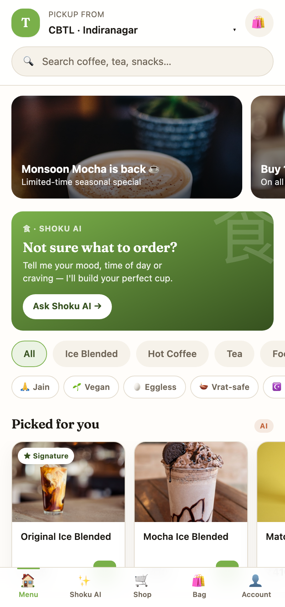
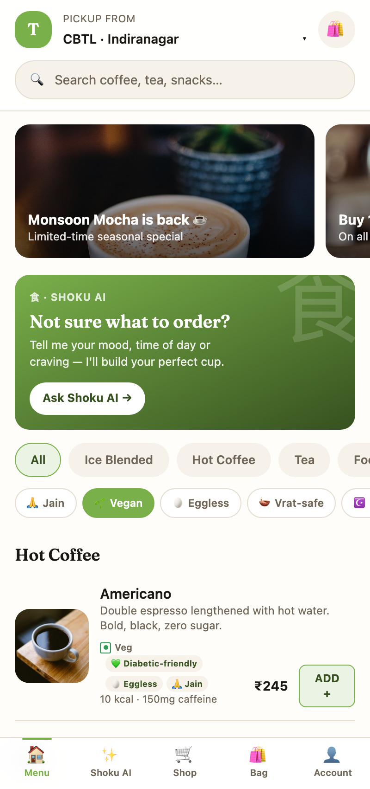
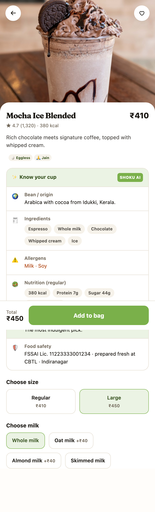
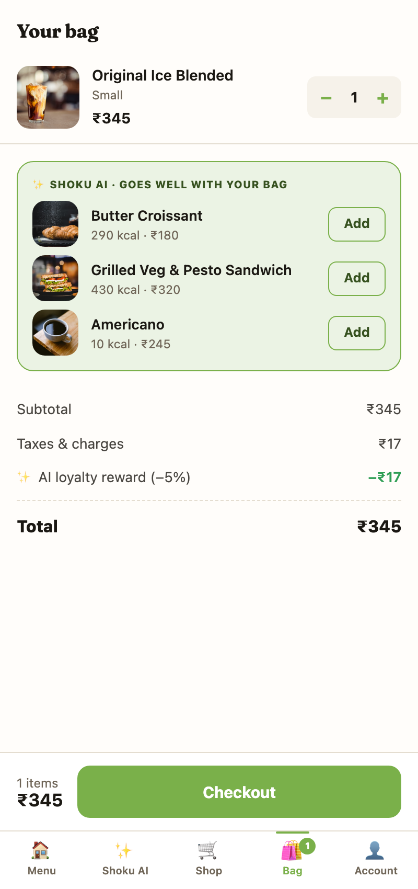
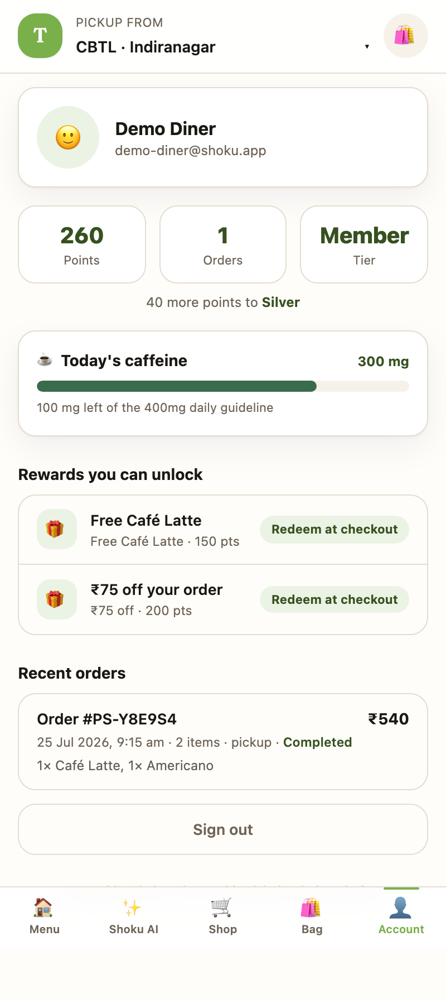
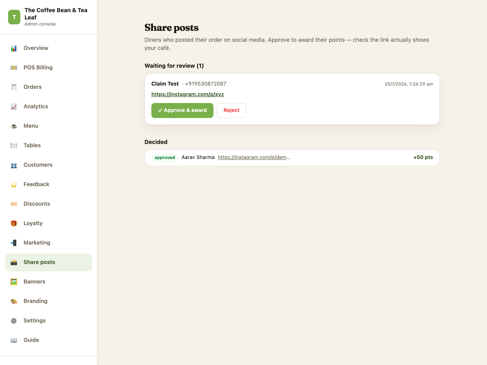
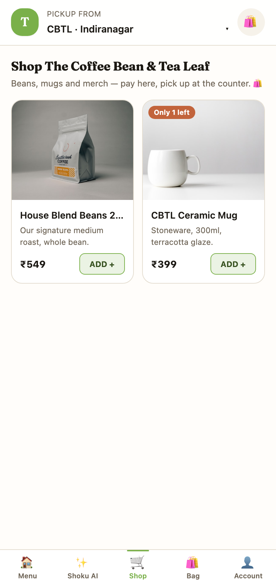
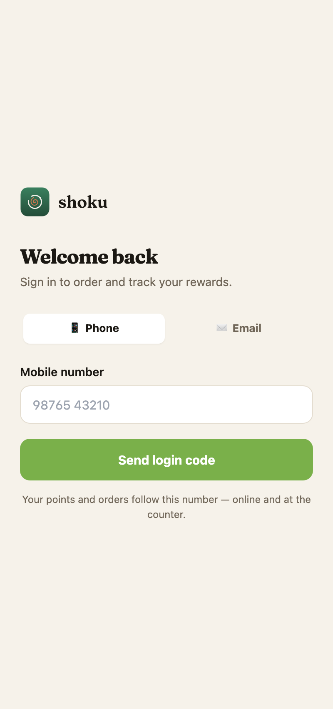
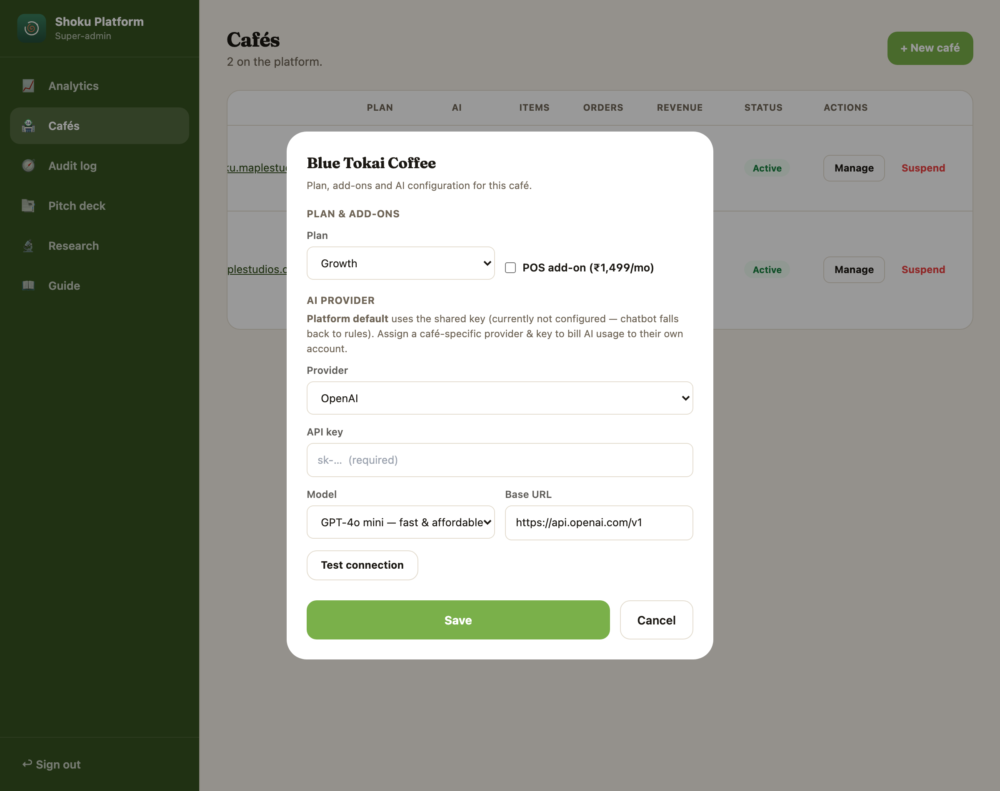

# Shoku — Diner Experience v2: Feature Testing Plan

For the team. Each feature below has: **what it is**, **how to test it** (exact steps),
**expected result** (pass criteria), and a **screenshot** of the working state. Test on a
seeded local build; if a screen doesn't match its screenshot, it's a bug — log it.

## Setup (once)

```bash
npm run setup                     # prisma db push + seed (creates the demo diner + café)
node scripts/demo-diner-setup.js  # puts the demo diner in a screenshot-ready state
node scripts/classify-diet.js     # tags every menu item (dietary badges)
npm run dev                       # http://localhost:3000
```

**Test accounts** (all password `password`):

| Who | Login | Where |
| --- | --- | --- |
| **Demo diner** | `demo-diner@shoku.app` / `password` · or phone **9899900000** (OTP) | storefront `/menu` |
| Café owner | `demo@shoku.app` / `password` | `/admin` |
| Platform superadmin | `super@shoku.app` / `password` | `/super` |

> The demo diner starts with 260 points, a caffeinated order placed **today** (for the
> caffeine ledger), and a **pending share** waiting in the café's approval queue.

---

## 1. Dietary filters + food-intelligence badges

**What:** the menu can be filtered by diet (Jain, Vegan, Eggless, Vrat-safe, Halal,
Diabetic-friendly, Low sugar, High protein). Every item shows its badges. Tags are
auto-derived from ingredients (conservative — a mayo item is never tagged vegan) and
owner-set for cultural tags (Halal/Vrat).

**How to test:**
1. Open `/menu` as the demo diner. Confirm the **diet chip row** sits under the category chips.
2. Confirm the bottom nav shows **5 tabs in one row** (Menu · Shoku AI · Shop · Bag · Account).
3. Tap **🌱 Vegan** — the list should shrink to only vegan-tagged items.
4. Tap it again to clear.

**Expected:** filtering visibly reduces the list; badges appear on item rows; no item with
milk/egg/mayo/gelatin is tagged vegan or jain.




---

## 2. Item page: badges, "lighter swap", Know-your-cup, FSSAI trust

**What:** the item page shows dietary badges, nutrition, allergens, origin, an AI tip, an
**FSSAI food-safety row**, and — when a meaningfully lighter same-category option exists — a
**"Lighter swap"** nudge (e.g. "78% less sugar").

**How to test:**
1. Open any item (e.g. `/item/cbtl-mocha-ice-blended`).
2. Check the **diet badges** under the title, the **Know your cup** panel (origin, ingredients,
   allergens, nutrition, AI tip), and the **🛡️ Food safety / FSSAI Lic.** row.
3. For the lighter-swap: open a high-sugar drink that has a lower-sugar sibling in the same
   category — the green "🍃 Lighter swap" card appears above the panel. (It's intentionally
   hidden when no lighter option exists.)

**Expected:** all intelligence sections render; FSSAI number shows; badges match the item.



---

## 3. Smart cart upsell (pairing engine)

**What:** adding items to the bag surfaces up to 3 **"goes well with your bag"** suggestions —
a drink-only bag suggests a bite, a food-only bag suggests a drink (weighted by rating/
signature/price). Not the old hardcoded croissant.

**How to test:**
1. From `/menu`, **ADD** a drink to the bag.
2. Open `/cart`. Confirm the **"✨ Shoku AI · goes well with your bag"** card shows relevant
   complementary items with an **Add** button.
3. Add a suggestion — it should drop into the bag and the totals update.

**Expected:** suggestions are contextual (not always the same item), never include merch, never
include what's already in the bag.



---

## 4. Caffeine ledger

**What:** the account page shows **today's caffeine** (mg) as a meter vs the 400 mg daily
guideline, computed from the diner's paid orders **in IST**.

**How to test:**
1. As the demo diner, open `/account`.
2. Confirm the **☕ Today's caffeine** card with a progress bar and "X mg left of the 400 mg
   daily guideline".
3. (Edge) An order placed after ~6:30 PM UTC still counts as *today* in IST — the meter resets
   at IST midnight, not UTC.

**Expected:** the meter reflects today's caffeinated orders; turns clay/over-limit past 400 mg.



---

## 5. Share-to-earn (Instagram/Snapchat rewards)

**What:** after ordering, the diner can submit a social-post link; the café approves it in
admin; points are awarded. One submission per rolling 24 h.

**How to test (diner side):**
1. Place an order → on `/success`, tap **"📸 Snap it, share it, earn 50 pts"** → **I posted it**.
2. Paste an `https://` link, **Submit for review**. Confirm the "Sent for review" state.
3. Try to submit again → blocked ("already shared in the last 24 hours").

**How to test (café side):** log in as `demo@shoku.app`, open **Admin → Share posts**. The
pending submission appears with the diner + link. Click **✓ Approve & award** → the diner's
points increase by the café's `sharePoints` (50). Clicking approve twice is rejected.

**Expected:** submit → café approves → diner points +50; a bogus/foreign order id is ignored;
double-approve is blocked.



---

## 6. Merch shelf (Shop tab)

**What:** each café has a **Shop** tab — beans, mugs, tees — bought through the normal checkout,
**picked up at the counter**, with live stock and "Only N left" / "Sold out" badges.

**How to test:**
1. Tap the **🛒 Shop** tab. Confirm the merch grid with prices and stock badges.
2. Add a low-stock item and check out; the stock decrements.
3. Try to add more than the stock allows — the **+** disables / order is refused (oversell → 409).

**Expected:** merch shows only in Shop (never on the food menu); stock reservation is atomic;
sold-out items can't be ordered.



---

## 7. Auth v2: phone-OTP, guest checkout, claim

**What:** diners sign in with **phone + OTP** (demo mode shows the code on screen until SMS keys
are set), can **checkout as a guest** (phone only), and the guest's orders/points **auto-claim**
onto their account on first OTP login. Email+password remains for staff.

**How to test:**
1. `/login` → **📱 Phone** tab (default). Enter a number → **Send login code**. In demo mode the
   6-digit code shows on screen → enter it → **Verify & sign in**.
2. **Guest checkout:** sign out, add items, go to `/checkout` → fill only the **guest phone** →
   place order. It succeeds without an account.
3. **Claim:** log in via OTP with that same phone → your guest order and points are now on the
   account (check `/account`).
4. **Security checks:** 5 wrong OTP codes invalidate the code (request a fresh one); a guest order
   on a phone that **already has an account** is refused ("please sign in").

**Expected:** OTP login works; guest order + claim carries orders/points; email/staff login still
works via the ✉️ Email tab.



---

## 8. Per-café AI key & plan (super-admin)

**What:** on the platform dashboard, each café can be given its **own AI provider + API key**, or
left on the **platform default** (which uses the plan's default model). This is how AI cost scales
with the café's plan and how a café can bill AI to its own account.

**How to test:**
1. Log in as `super@shoku.app`, open **Cafés**. Each row shows an **AI** column badge
   (`Rules` = no key, falls back to rules; or the model name).
2. Click **Manage** on a café → the drawer shows **Plan & add-ons** and **AI provider**.
3. Pick a **Provider** (e.g. OpenAI / Anthropic) → the **API key**, **Model** and **Base URL**
   fields appear. Enter a key, click **Test connection**, then **Save**.
4. Leave it on **Platform default** to use the shared key + plan-default model.

**Expected:** the key is stored write-only (shows •••• once set); Test connection validates it;
saving updates the café's AI config and is audit-logged.



---

## Regression checklist (must still pass)

- [ ] Email + password login (diner and staff) via the ✉️ Email tab
- [ ] Checkout totals match what's charged (tax = café GST rate, floored at 0)
- [ ] Loyalty redeem at checkout for a signed-in diner (guests can't redeem)
- [ ] POS billing, KOT/invoice print, day-end report (owner)
- [ ] Analytics + per-location revenue (owner)
- [ ] `npm run test` → all unit tests green (57)

## How to log a bug

Note the **feature #**, the **step** that failed, what you **expected vs saw**, the **account**
used, and a screenshot. File it against the `feat/diner-experience-v2` work.
